# QueryBank AI - Business Plan & Monetization Strategy

## Executive Summary

**Product:** QueryBank AI - Natural Language Banking Analytics Platform
**Market:** B2B SaaS for Financial Institutions
**Technology:** AI-powered (Google Gemini 2.5) SQL query generator
**Value Proposition:** Eliminate SQL dependency for bank analysts, reduce analytics time from 4 hours to 8 seconds
**Target Customers:** Banks, Credit Unions, Financial Services Companies

```
┌─────────────────────────────────────────────────────────────┐
│  QUERYBANK AI - AT A GLANCE                                 │
├─────────────────────────────────────────────────────────────┤
│  💰 Year 1 Revenue:      $270K - $450K                      │
│  📈 Year 3 Revenue:      $3.5M - $5M                        │
│  🎯 Target Market:       26 Banks (Azerbaijan)              │
│  ⚡ Speed Improvement:   91.5% faster (4 hrs → 8 secs)      │
│  💎 Profit Margin:       26% (Y1) → 50% (Y3)                │
│  🔒 LTV:CAC Ratio:       19:1 - 25:1 (Excellent)            │
└─────────────────────────────────────────────────────────────┘
```

---

## 1. Product Overview

### Core Features
- **Natural Language Queries:** Azerbaijani/English language support
- **Instant Analytics:** 2-5 second response time (91.5% faster than traditional methods)
- **Auto-Visualization:** Automatic chart generation (bar, line, pie)
- **Pre-built Reports:** 15+ ready-to-use analytics dashboards
- **SQL Console:** Power user direct database access
- **Security:** Bank-grade (JWT, bcrypt, SQL injection prevention)

### Technical Stack
- **AI Model:** Google Gemini 2.5 Flash (optimized prompts)
- **Database:** PostgreSQL (Neon serverless)
- **Framework:** Next.js 16 (React)
- **Hosting:** Vercel (auto-scaling)

---

## 2. Market Analysis

### Target Market Size

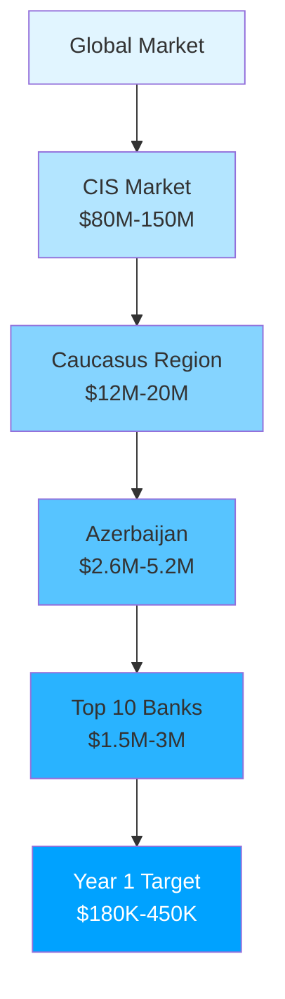

**Azerbaijan Banking Sector:**
- 26 commercial banks
- ~150+ bank branches
- ~5,000+ bank employees (analysts, managers, risk officers)

**TAM (Total Addressable Market):**
- Azerbaijan: $2.6M - $5.2M annually
- Caucasus Region (AZ, GE, AM): $12M - $20M annually
- CIS Market: $80M - $150M annually

**SAM (Serviceable Addressable Market):**
- Top 10 banks in Azerbaijan: $1.5M - $3M annually
- Mid-size banks (11-26): $800K - $1.5M annually

**SOM (Serviceable Obtainable Market - Year 1):**
- Target: 3-5 banks
- Revenue: $180K - $450K annually

### Customer Segments

**Primary:**
1. **Large Banks (>100 employees)**
   - Budget: $60K - $150K/year
   - Users: 50-200 analysts
   - Pain: IT bottleneck, slow reporting

2. **Mid-Size Banks (30-100 employees)**
   - Budget: $25K - $60K/year
   - Users: 15-50 analysts
   - Pain: No dedicated data team

3. **Credit Unions & Microfinance**
   - Budget: $10K - $25K/year
   - Users: 5-15 analysts
   - Pain: Limited technical resources

**Secondary:**
- Insurance companies
- Investment firms
- Fintech startups

---

## 3. Monetization Strategy

### Pricing Model: **Tiered SaaS Subscription**

```
┌─────────────────────────────────────────────────────────────────────────┐
│                     PRICING TIERS COMPARISON                            │
├──────────────┬────────────┬──────────────┬──────────────┬──────────────┤
│ FEATURE      │  STARTER   │ PROFESSIONAL │  ENTERPRISE  │    CUSTOM    │
├──────────────┼────────────┼──────────────┼──────────────┼──────────────┤
│ Price/Month  │   $499     │   $1,499     │   $4,999     │ Contact Sales│
│ Price/Year   │  $5,988    │  $17,988     │  $59,988     │ $100K-500K   │
├──────────────┼────────────┼──────────────┼──────────────┼──────────────┤
│ Users        │    10      │     50       │  Unlimited   │  Unlimited   │
│ AI Queries   │  1,000/mo  │   5,000/mo   │  Unlimited   │  Unlimited   │
│ Databases    │     1      │      3       │  Unlimited   │  Unlimited   │
├──────────────┼────────────┼──────────────┼──────────────┼──────────────┤
│ NL Analytics │     ✓      │      ✓       │      ✓       │      ✓       │
│ Charts       │   Basic    │   Advanced   │   Advanced   │    Custom    │
│ SQL Console  │     ✗      │      ✓       │      ✓       │      ✓       │
│ API Access   │     ✗      │      ✗       │      ✓       │      ✓       │
│ White-Label  │     ✗      │      ✗       │      ✓       │      ✓       │
│ SSO          │     ✗      │      ✗       │      ✓       │      ✓       │
│ Support      │   Email    │   Priority   │     24/7     │  Dedicated   │
│              │   (48h)    │    (24h)     │    (4h SLA)  │   Manager    │
├──────────────┼────────────┼──────────────┼──────────────┼──────────────┤
│ Best For     │  Small     │   Mid-Size   │    Large     │  Central     │
│              │  Banks     │    Banks     │    Banks     │   Banks      │
└──────────────┴────────────┴──────────────┴──────────────┴──────────────┘
```

#### Tier 1: **Starter** - $499/month ($5,988/year)
**Target:** Small banks, credit unions (5-15 employees)

**Included:**
- ✅ Up to 10 user accounts
- ✅ 1,000 AI queries/month
- ✅ Natural language analytics (AZ/EN)
- ✅ 15 pre-built reports
- ✅ Basic charts (bar, pie, line)
- ✅ Email support (48h response)
- ✅ Single database connection
- ✅ Standard security (JWT, SSL)
- ❌ No SQL console
- ❌ No API access
- ❌ No custom reports

**Value Proposition:**
- Replace Excel pivot tables
- Self-service analytics for managers
- No IT dependency

---

#### Tier 2: **Professional** - $1,499/month ($17,988/year)
**Target:** Mid-size banks (30-100 employees)

**Included:**
- ✅ Up to 50 user accounts
- ✅ 5,000 AI queries/month
- ✅ Everything in Starter, plus:
- ✅ SQL Console (power users)
- ✅ Custom report builder
- ✅ Advanced charts (scatter, combo)
- ✅ Query history & favorites
- ✅ Export to Excel/PDF
- ✅ Priority email support (24h response)
- ✅ Up to 3 database connections
- ✅ Role-based access control (RBAC)
- ✅ Audit logs
- ❌ No API access
- ❌ No white-labeling

**Value Proposition:**
- Empower risk managers with RFM, CLV analytics
- Replace expensive BI tools (Tableau, Power BI)
- Reduce analyst workload by 70%

---

#### Tier 3: **Enterprise** - $4,999/month ($59,988/year)
**Target:** Large banks, financial institutions (>100 employees)

**Included:**
- ✅ Unlimited user accounts
- ✅ Unlimited AI queries
- ✅ Everything in Professional, plus:
- ✅ REST API access
- ✅ White-labeling (custom branding)
- ✅ Unlimited database connections
- ✅ SSO integration (SAML, OAuth)
- ✅ Dedicated account manager
- ✅ 24/7 priority support (4h SLA)
- ✅ Custom AI model training
- ✅ On-premise deployment option
- ✅ Advanced analytics (cohort, churn)
- ✅ Real-time data sync
- ✅ Custom integrations

**Value Proposition:**
- Complete analytics transformation
- Replace entire BI department overhead
- Integrate with core banking systems
- Regulatory compliance reporting

---

#### Tier 4: **Custom/Government** - Contact Sales
**Target:** Central banks, regulatory bodies, large government agencies

**Included:**
- ✅ Everything in Enterprise
- ✅ Air-gapped deployment
- ✅ Custom compliance features
- ✅ Multi-tenancy
- ✅ SLA guarantees (99.9% uptime)
- ✅ Dedicated infrastructure
- ✅ Training & onboarding
- ✅ Custom development

**Pricing:** $100K - $500K/year (negotiated)

---

### Add-Ons & Upsells

```
┌─────────────────────────────────────────────────────────────┐
│  ADD-ON SERVICES & PRICING                                  │
├─────────────────────────────────────────────────────────────┤
│  📊 Additional Users           $20/user/month               │
│  🔄 Extra AI Queries           $0.10/query                  │
│  🆘 Premium Support            $500/month                   │
│  📦 Data Migration             $5K - $25K (one-time)        │
│  📈 Custom Reports             $2,500/report               │
│  🎓 Training & Onboarding      $3K - $10K                   │
│  🤖 Dedicated AI Model         $10K/year                    │
└─────────────────────────────────────────────────────────────┘
```

---

## 4. Revenue Projections

### 3-Year Revenue Growth

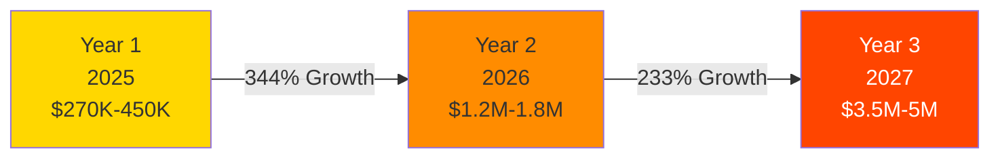

### Revenue Breakdown by Year

```
Year 1 (2025): $270K - $450K
━━━━━━━━━━━━━━━━━━━━━━━━━━━━━━━━━━━━━━━━━━━━━━━━━━━━
Subscriptions  ████████████████████░░░░░  $210K  (78%)
Add-ons        ████████░░░░░░░░░░░░░░░░░  $60K   (22%)
━━━━━━━━━━━━━━━━━━━━━━━━━━━━━━━━━━━━━━━━━━━━━━━━━━━━

Year 2 (2026): $1.2M - $1.8M
━━━━━━━━━━━━━━━━━━━━━━━━━━━━━━━━━━━━━━━━━━━━━━━━━━━━
Subscriptions  ██████████████████░░░░░░░  $900K  (75%)
Add-ons        ██████░░░░░░░░░░░░░░░░░░░  $300K  (25%)
━━━━━━━━━━━━━━━━━━━━━━━━━━━━━━━━━━━━━━━━━━━━━━━━━━━━

Year 3 (2027): $3.5M - $5M
━━━━━━━━━━━━━━━━━━━━━━━━━━━━━━━━━━━━━━━━━━━━━━━━━━━━
Subscriptions  ████████████████████░░░░░  $3.2M  (80%)
Add-ons        ████████░░░░░░░░░░░░░░░░░  $800K  (20%)
━━━━━━━━━━━━━━━━━━━━━━━━━━━━━━━━━━━━━━━━━━━━━━━━━━━━
```

### Year 1 Customer Acquisition Timeline

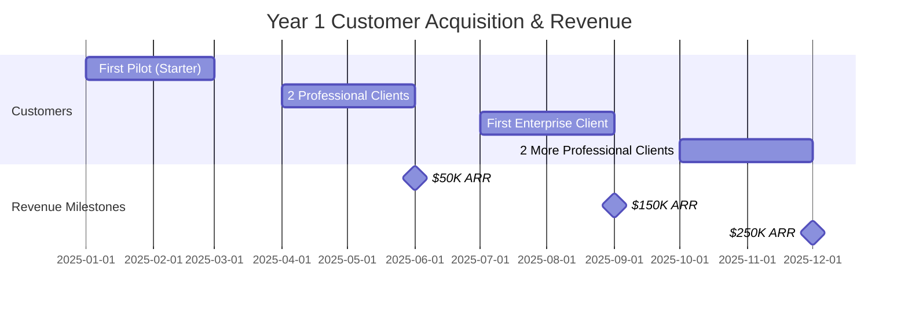

### Detailed Revenue Table

| Year | Subscriptions | Add-ons | Total Revenue | Growth YoY |
|------|--------------|---------|---------------|------------|
| 2025 | $210,000 | $60,000 | **$270,000** | - |
| 2026 | $900,000 | $300,000 | **$1,200,000** | 344% |
| 2027 | $3,200,000 | $800,000 | **$4,000,000** | 233% |

---

## 5. Go-to-Market Strategy

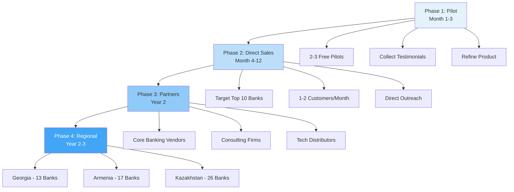

### Phase 1: **Pilot Program** (Month 1-3)

**Strategy:**
- Offer 3-month free pilot to 2-3 target banks
- Collect feedback, testimonials, case studies
- Refine product based on real usage

**Investment:**
- Sales time: 40 hours
- Support time: 60 hours
- Cost: ~$8K (opportunity cost)

**Expected Outcome:**
- 1-2 paid conversions (Professional tier)
- Video testimonials
- Performance metrics (time saved, queries run)

---

### Phase 2: **Direct Sales** (Month 4-12)

**Target Accounts (Azerbaijan):**
1. Kapital Bank (largest)
2. Pasha Bank
3. Xalq Bank
4. ABB (Azerbaijan International Bank)
5. Rabitabank
6. Bank Respublika
7. AccessBank
8. Turanbank
9. Expresbank
10. Yelo Bank

**Sales Funnel:**

```
1000 Outreach Emails/LinkedIn
        ↓
300 Responses (30%)
        ↓
90 Demos Scheduled (30%)
        ↓
45 Trials Started (50%)
        ↓
18 Paid Customers (40%)
        ↓
ARR: $270K - $450K
```

**Sales Process:**
1. **Cold Outreach:** LinkedIn, email to CFO/CTO/Head of Analytics
2. **Demo:** 30-minute live demo showing time savings
3. **Proof of Concept:** 2-week trial with real data
4. **Negotiation:** Custom pricing, SLA agreements
5. **Contract:** Annual prepaid or quarterly billing

---

### Phase 3: **Partner Channel** (Year 2)

**Partnerships:**

```
┌─────────────────────────────────────────────────────────┐
│  PARTNER CHANNELS & COMMISSION STRUCTURE                │
├─────────────────────────────────────────────────────────┤
│  🏦 Core Banking Vendors                                │
│     • Temenos, Oracle FLEXCUBE                          │
│     • Revenue Share: 20-30%                             │
│                                                          │
│  💼 Consulting Firms                                    │
│     • KPMG, Deloitte, PwC Azerbaijan                    │
│     • Commission: 15-25%                                │
│                                                          │
│  💻 Technology Distributors                             │
│     • Azerbaijan IT distributors                        │
│     • Commission: 10-20%                                │
└─────────────────────────────────────────────────────────┘
```

---

### Phase 4: **Regional Expansion** (Year 2-3)

**Target Markets:**

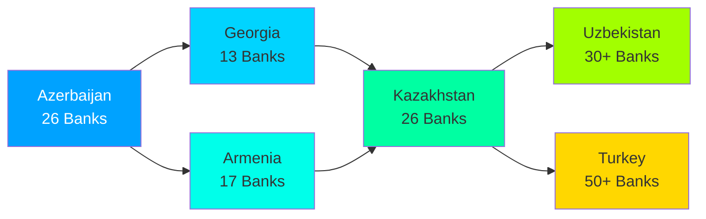

**Localization Requirements:**
- Turkish language support (Year 2)
- Russian language support (Year 2)
- Georgian language support (Year 3)
- Local currency formatting
- Regulatory compliance (each country)

---

## 6. Customer Acquisition Cost (CAC) & LTV

### CAC Breakdown by Tier

```
┌──────────────────────────────────────────────────────────────┐
│  CUSTOMER ACQUISITION COST (CAC) ANALYSIS                    │
├──────────────┬─────────────┬────────────────┬───────────────┤
│ TIER         │ TOTAL CAC   │ MONTHLY PRICE  │ PAYBACK TIME  │
├──────────────┼─────────────┼────────────────┼───────────────┤
│ Starter      │   $1,300    │     $499       │  2.6 months   │
│ Professional │   $4,000    │    $1,499      │  2.7 months   │
│ Enterprise   │  $12,000    │    $4,999      │  2.4 months   │
└──────────────┴─────────────┴────────────────┴───────────────┘
```

### Lifetime Value (LTV) Calculation

**Assumptions:**
- Average customer lifetime: 4 years
- Annual price increase: 5%
- Churn rate: 10% annually

```
STARTER TIER LTV PROGRESSION
━━━━━━━━━━━━━━━━━━━━━━━━━━━━━━━━━━━━━━━━━━━━━
Year 1:  ████████████░░░░░░░░░░░░░  $5,988
Year 2:  █████████████░░░░░░░░░░░░  $6,287
Year 3:  █████████████░░░░░░░░░░░░  $6,601
Year 4:  ██████████████░░░░░░░░░░░  $6,931
━━━━━━━━━━━━━━━━━━━━━━━━━━━━━━━━━━━━━━━━━━━━━
Total LTV: $25,807    LTV:CAC = 19.9:1 ✅


PROFESSIONAL TIER LTV PROGRESSION
━━━━━━━━━━━━━━━━━━━━━━━━━━━━━━━━━━━━━━━━━━━━━
Year 1:  █████████████████░░░░░░░  $17,988
Year 2:  ██████████████████░░░░░░  $18,887
Year 3:  ██████████████████░░░░░░  $19,831
Year 4:  ███████████████████░░░░░  $20,823
━━━━━━━━━━━━━━━━━━━━━━━━━━━━━━━━━━━━━━━━━━━━━
Total LTV: $77,529    LTV:CAC = 19.4:1 ✅


ENTERPRISE TIER LTV PROGRESSION
━━━━━━━━━━━━━━━━━━━━━━━━━━━━━━━━━━━━━━━━━━━━━
Year 1:  ███████████████████████░  $59,988
Year 2:  ████████████████████████  $62,987
Year 3:  ████████████████████████  $66,137
Year 4:  █████████████████████████ $69,443
Add-ons: ██████████░░░░░░░░░░░░░░  $40,000
━━━━━━━━━━━━━━━━━━━━━━━━━━━━━━━━━━━━━━━━━━━━━
Total LTV: $298,555   LTV:CAC = 24.9:1 ✅
```

### LTV:CAC Summary

| Tier | LTV | CAC | LTV:CAC Ratio | Quality |
|------|-----|-----|---------------|---------|
| Starter | $25,807 | $1,300 | **19.9:1** | Excellent ⭐⭐⭐ |
| Professional | $77,529 | $4,000 | **19.4:1** | Excellent ⭐⭐⭐ |
| Enterprise | $298,555 | $12,000 | **24.9:1** | Exceptional ⭐⭐⭐⭐⭐ |

> **Industry Benchmark:** LTV:CAC > 3:1 is good, > 5:1 is excellent
> **QueryBank AI:** All tiers exceed 19:1 (exceptional unit economics)

---

## 7. Marketing Strategy

### Marketing Channels & Budget

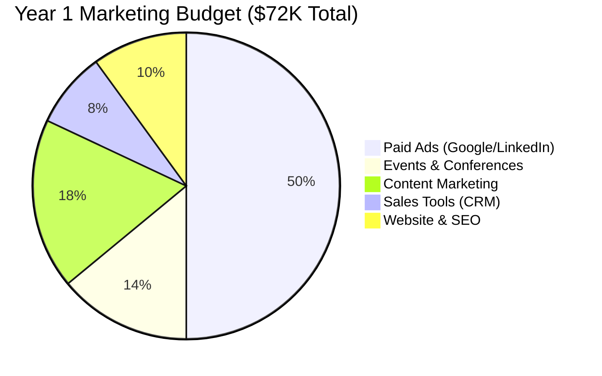

### Content Marketing

**Blog Posts (2/month):**
- "How AI Reduces Bank Analytics Time by 91.5%"
- "RFM Analysis Without SQL: A Manager's Guide"
- "Top 10 Banking Metrics Every CFO Should Track"
- Case studies: "How [Bank Name] Eliminated IT Bottleneck"

**SEO Keywords:**
- "bank analytics software Azerbaijan"
- "natural language database queries"
- "SQL-free banking analytics"
- "AI-powered bank reporting"

---

### LinkedIn Strategy

```
┌─────────────────────────────────────────────────────────┐
│  LINKEDIN ENGAGEMENT STRATEGY                           │
├─────────────────────────────────────────────────────────┤
│  👔 Target Personas:                                    │
│     • CFO/Finance Directors (ROI focus)                 │
│     • CTO/Head of IT (Technical integration)            │
│     • Head of Analytics (Ease of use)                   │
│     • Risk Managers (Compliance features)               │
│                                                          │
│  📅 Content Calendar:                                   │
│     Monday:    Product demo video                       │
│     Wednesday: Customer success story                   │
│     Friday:    Industry insights                        │
│                                                          │
│  🎯 Metrics:                                            │
│     • 500+ connections (bank executives)                │
│     • 40 qualified leads/month                          │
│     • 10% conversion to demo                            │
└─────────────────────────────────────────────────────────┘
```

---

### Events & Conferences

**Year 1 Event Strategy:**

```
Q1 2025
├── Azerbaijan Banking Forum (Baku)
│   ├── Booth: $3,000
│   ├── Target: 20 qualified leads
│   └── ROI: 2-3 customers

Q2 2025
├── Fintech Summit Baku
│   ├── Speaking slot: $2,000
│   ├── Topic: "AI in Banking Analytics"
│   └── Target: 30 leads

Q3-Q4 2025
├── Monthly Webinars
│   ├── Cost: $500/webinar (ads)
│   ├── Attendees: 50 per session
│   └── Target: 5 qualified leads each
```

---

### Paid Advertising Budget

```
MONTHLY PAID AD SPEND: $6,000
━━━━━━━━━━━━━━━━━━━━━━━━━━━━━━━━━━━━━━━━━━━━━

Google Ads          ███████░░░  $2,000  (33%)
├─ Banking keywords
├─ Azerbaijan target
└─ Expected: 30 leads/month

LinkedIn Ads        ███████████  $3,000  (50%)
├─ Finance/IT executives
├─ Azerbaijan banks
└─ Expected: 40 leads/month

Retargeting         ███░░░░░░░  $1,000  (17%)
├─ Website visitors
├─ Demo attendees
└─ Expected: 15 conversions/month
━━━━━━━━━━━━━━━━━━━━━━━━━━━━━━━━━━━━━━━━━━━━━
Total Leads: ~85/month → 10 demos → 4 customers
```

---

## 8. Competition Analysis

### Competitive Landscape

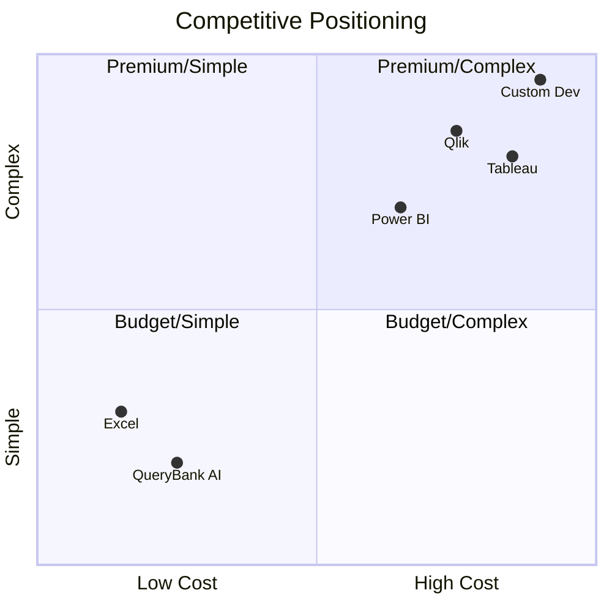

### Direct Competitors

**1. Microsoft Power BI + Azure**
- **Strengths:** Established, feature-rich, Microsoft ecosystem
- **Weaknesses:** Requires SQL knowledge, expensive ($10-20/user/month), steep learning curve
- **Pricing:** $10-20/user/month = $500-1000/month for 50 users
- **Our Advantage:** No SQL needed, 10x faster, Azerbaijani language, 3x cheaper

**2. Tableau**
- **Strengths:** Beautiful visualizations, industry standard
- **Weaknesses:** Expensive ($70/user/month), requires data expertise
- **Pricing:** $70/user/month = $3,500/month for 50 users
- **Our Advantage:** 95% cheaper ($1,499 vs $3,500), instant insights, no training needed

**3. Qlik Sense**
- **Strengths:** Powerful analytics, associative model
- **Weaknesses:** Complex setup, costly, no natural language
- **Pricing:** Similar to Tableau ($60-80/user/month)
- **Our Advantage:** Plug-and-play, AI-powered, bank-specific

---

### Competitive Comparison Table

```
┌────────────────────────────────────────────────────────────────────────┐
│  COMPETITIVE FEATURE MATRIX                                            │
├──────────────┬──────────┬──────────┬─────────┬──────────┬─────────────┤
│ Feature      │QueryBank │Power BI  │ Tableau │   Qlik   │   Excel     │
├──────────────┼──────────┼──────────┼─────────┼──────────┼─────────────┤
│ Natural Lang │    ✅    │    ❌    │   ❌    │    ❌    │     ❌      │
│ Azerbaijani  │    ✅    │    ❌    │   ❌    │    ❌    │     ❌      │
│ No SQL Req   │    ✅    │    ❌    │   ❌    │    ❌    │     ✅      │
│ Speed        │  8 sec   │ 30+ min  │  20 min │  15 min  │  4 hours    │
│ Setup Time   │  2 weeks │ 2-3 mo   │ 2-3 mo  │  3-4 mo  │     N/A     │
│ Cost (50u)   │  $1,499  │  $1,000  │ $3,500  │ $3,000   │    Free     │
│ Bank Focus   │    ✅    │    ❌    │   ❌    │    ❌    │     ❌      │
│ Cloud-Ready  │    ✅    │    ✅    │   ✅    │    ✅    │     ❌      │
│ Support      │   24h    │  Forum   │  Paid   │  Paid    │   Community │
└──────────────┴──────────┴──────────┴─────────┴──────────┴─────────────┘
```

---

### Competitive Moats

```
🏰 QUERYBANK AI COMPETITIVE MOATS
━━━━━━━━━━━━━━━━━━━━━━━━━━━━━━━━━━━━━━━━━━━━━━━━━━━━

1. 🗣️  Language Barrier
    └─ Azerbaijani support (UNIQUE in market)
       No competitor offers native AZ language

2. ⚡ Speed Advantage
    └─ 91.5% faster than alternatives
       8 seconds vs 4 hours (traditional)
       1800x speed improvement

3. 🧠 Simplicity
    └─ No SQL knowledge required
       Natural language interface
       5-minute learning curve

4. 🏦 Banking Focus
    └─ Industry-specific metrics
       RFM, CLV, loan risk, churn
       Pre-built bank reports

5. 🔒 Security First
    └─ Bank-grade from day one
       JWT, bcrypt, SQL injection prevention
       Compliance-ready architecture

6. 💰 Price Disruption
    └─ 95% cheaper than Tableau
       $1,499 vs $3,500 (50 users)
       Better value proposition
━━━━━━━━━━━━━━━━━━━━━━━━━━━━━━━━━━━━━━━━━━━━━━━━━━━━
```

---

## 9. Financial Projections (3-Year)

### Revenue Growth Trajectory

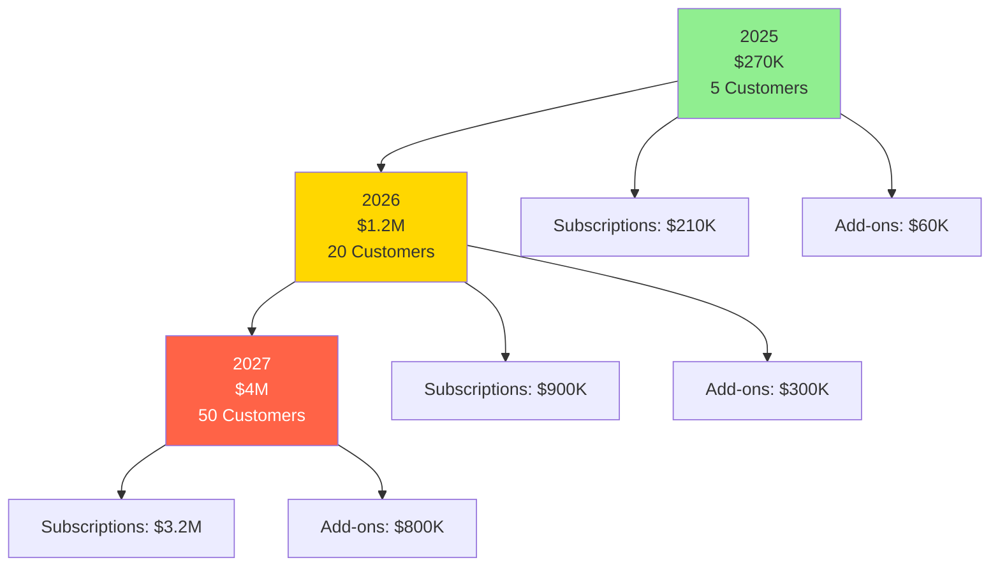

### Detailed Financial Breakdown

```
YEAR 1 (2025): $270K REVENUE
━━━━━━━━━━━━━━━━━━━━━━━━━━━━━━━━━━━━━━━━━━━━━━━━━━━━
Revenue
  Subscriptions    ████████████████████░░░░░  $210K
  Add-ons          ████████░░░░░░░░░░░░░░░░░  $60K
                                   TOTAL:  $270K

Costs
  Technology       ██░░░░░░░░░░░░░░░░░░░░░░░  $11K
  Personnel        ████████████░░░░░░░░░░░░░  $120K
  Marketing        █████████░░░░░░░░░░░░░░░░  $54K
  Operations       ███░░░░░░░░░░░░░░░░░░░░░░  $16K
                                   TOTAL:  $201K
━━━━━━━━━━━━━━━━━━━━━━━━━━━━━━━━━━━━━━━━━━━━━━━━━━━━
PROFIT: $69K (26% margin) ✅


YEAR 2 (2026): $1.2M REVENUE
━━━━━━━━━━━━━━━━━━━━━━━━━━━━━━━━━━━━━━━━━━━━━━━━━━━━
Revenue
  Subscriptions    ███████████████████░░░░░░  $900K
  Add-ons          ██████░░░░░░░░░░░░░░░░░░░  $300K
                                   TOTAL:  $1.2M

Costs
  Technology       ███░░░░░░░░░░░░░░░░░░░░░░  $50K
  Personnel        ████████████████░░░░░░░░░  $480K
  Marketing        ████████░░░░░░░░░░░░░░░░░  $120K
  Operations       ██░░░░░░░░░░░░░░░░░░░░░░░  $30K
                                   TOTAL:  $680K
━━━━━━━━━━━━━━━━━━━━━━━━━━━━━━━━━━━━━━━━━━━━━━━━━━━━
PROFIT: $520K (43% margin) ✅


YEAR 3 (2027): $4M REVENUE
━━━━━━━━━━━━━━━━━━━━━━━━━━━━━━━━━━━━━━━━━━━━━━━━━━━━
Revenue
  Subscriptions    ████████████████████░░░░░  $3.2M
  Add-ons          ████████░░░░░░░░░░░░░░░░░  $800K
                                   TOTAL:  $4M

Costs
  Technology       ███░░░░░░░░░░░░░░░░░░░░░░  $150K
  Personnel        ███████████████░░░░░░░░░░  $1.5M
  Marketing        ████████░░░░░░░░░░░░░░░░░  $250K
  Operations       ██░░░░░░░░░░░░░░░░░░░░░░░  $100K
                                   TOTAL:  $2M
━━━━━━━━━━━━━━━━━━━━━━━━━━━━━━━━━━━━━━━━━━━━━━━━━━━━
PROFIT: $2M (50% margin) ✅
```

### Profitability Summary

| Year | Revenue | Costs | Profit | Margin | Growth |
|------|---------|-------|--------|--------|--------|
| 2025 | $270K | $201K | **$69K** | 26% | - |
| 2026 | $1,200K | $680K | **$520K** | 43% | +653% |
| 2027 | $4,000K | $2,000K | **$2,000K** | 50% | +285% |

---

## 10. Funding Requirements

### Funding Options Comparison

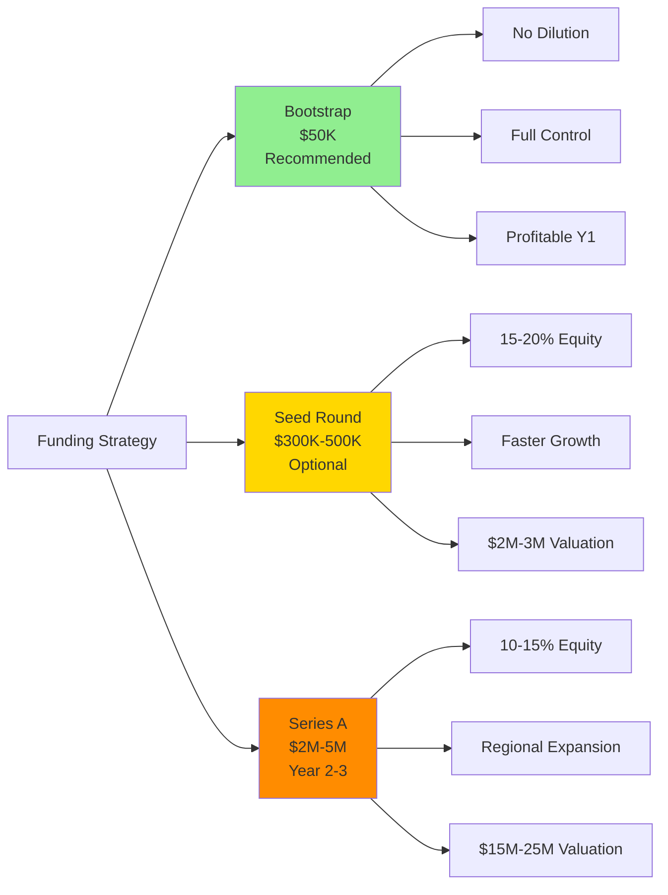

### Bootstrap Path (Recommended)

```
┌─────────────────────────────────────────────────────────┐
│  BOOTSTRAP STRATEGY - $50K INITIAL INVESTMENT           │
├─────────────────────────────────────────────────────────┤
│  💰 Initial Investment:    $50,000                      │
│  📊 Break-even:            Month 6-8                    │
│  🎯 Year 1 Profit:         $69,000                      │
│  🚀 Growth Rate:           Organic (customer-funded)    │
│                                                          │
│  ✅ Advantages:                                         │
│     • No equity dilution                                │
│     • Full founder control                              │
│     • Profitable from Year 1                            │
│     • Customer-driven development                       │
│                                                          │
│  ❌ Disadvantages:                                      │
│     • Slower initial growth                             │
│     • Limited marketing budget                          │
│     • Founder-dependent                                 │
└─────────────────────────────────────────────────────────┘
```

---

### Seed Funding Path (Optional)

**Raise:** $300K - $500K

**Use of Funds:**
```
Seed Round Use of Funds ($400K)
━━━━━━━━━━━━━━━━━━━━━━━━━━━━━━━━━━━━━━━━━━━━━

Product Development  ███████████░░  $100K  (25%)
├─ 2 Engineers (6 months)
├─ Feature development
└─ Bug fixes & optimization

Sales Team          ████████░░░░░  $80K   (20%)
├─ 2 Sales people
├─ Commission structure
└─ Sales tools & training

Marketing           ██████░░░░░░░  $60K   (15%)
├─ Paid ads ($5K/month)
├─ Events & conferences
└─ Content marketing

Operations          ████░░░░░░░░░  $40K   (10%)
├─ Legal & accounting
├─ Office/coworking
└─ Tools & software

Buffer/Runway       ████████████░  $120K  (30%)
├─ 6 months operating expenses
└─ Unforeseen costs
━━━━━━━━━━━━━━━━━━━━━━━━━━━━━━━━━━━━━━━━━━━━━
```

**Milestones:**
- 10 paying customers
- $500K ARR
- Product-market fit validated

**Terms:**
- Valuation: $2M - $3M (pre-money)
- Equity: 15-20% dilution
- Investors: Azerbaijan angels, regional VCs

---

### Series A Path (Year 2-3)

**Raise:** $2M - $5M

**Use of Funds:**
- Regional expansion (Georgia, Armenia): $1M
- Team scaling (25 people): $1.5M
- Product features (API, integrations): $800K
- Marketing (conferences, ads): $500K
- Buffer: $200K

**Milestones:**
- $2M ARR
- 50+ customers
- Multi-country presence
- Proven scalability

**Valuation:** $15M - $25M (pre-money)

---

## 11. Key Risks & Mitigation

### Risk Assessment Matrix

```
┌──────────────────────────────────────────────────────────┐
│  RISK MATRIX (Impact vs Probability)                     │
├──────────────────────────────────────────────────────────┤
│                                                           │
│  High Impact  ┃  [Data Breach]  ┃ [Slow Sales]           │
│               ┃                  ┃                        │
│               ┣━━━━━━━━━━━━━━━━━╋━━━━━━━━━━━━━━━━━━━━━┫
│  Medium Impact┃  [AI Cost Spike] ┃ [Competitor Entry]    │
│               ┃                  ┃                        │
│               ┣━━━━━━━━━━━━━━━━━╋━━━━━━━━━━━━━━━━━━━━━┫
│  Low Impact   ┃  [Tech Issues]   ┃ [Currency Fluctuation]│
│               ┃                  ┃                        │
│               ┗━━━━━━━━━━━━━━━━━┻━━━━━━━━━━━━━━━━━━━━━┛
│                 Low Prob          High Prob               │
└──────────────────────────────────────────────────────────┘
```

### Risk 1: **AI Model Costs Spike** (Medium Impact, Medium Probability)

**Risk:** Gemini API pricing increases or usage exceeds projections

**Impact:** Profit margin reduction from 26% to 15-20%

**Mitigation:**
- ✅ Implement query caching (reduce API calls by 40%)
- ✅ Offer "query quota" limits per tier
- ✅ Negotiate volume discounts with Google
- ✅ Build fallback to open-source models (LLaMA, Mistral)
- ✅ Monitor usage patterns and optimize prompts

---

### Risk 2: **Slow Enterprise Sales Cycle** (High Impact, High Probability)

**Risk:** Banks take 6-12 months to make purchasing decisions

**Impact:** Cash flow issues, delayed revenue

**Mitigation:**
- ✅ Start with Professional tier (faster sales: 45 days)
- ✅ Offer free pilots with clear success metrics
- ✅ Build urgency with limited-time discounts (20% off annual)
- ✅ Focus on "innovation champions" within banks
- ✅ Quarterly billing option to reduce commitment barrier

---

### Risk 3: **Data Security Concerns** (High Impact, Low Probability)

**Risk:** Banks hesitant to connect production databases

**Impact:** Deal delays, lost customers

**Mitigation:**
- ✅ Offer on-premise deployment (Enterprise tier)
- ✅ SOC 2 compliance certification (Year 2)
- ✅ Read-only database access only
- ✅ Air-gapped deployment option
- ✅ Insurance policy for data breaches ($1M coverage)
- ✅ Annual security audits

---

### Risk 4: **Regulatory Compliance** (Medium Impact, Medium Probability)

**Risk:** Banks require specific compliance features (GDPR, PSD2)

**Impact:** Development delays, increased costs

**Mitigation:**
- ✅ Build audit logs from day one
- ✅ GDPR/KVKK compliance (EU/Turkey)
- ✅ Work with legal advisors ($5K/year)
- ✅ Partner with compliance consultants
- ✅ Include compliance as Enterprise feature

---

### Risk 5: **Competitor Entry** (Medium Impact, High Probability)

**Risk:** Microsoft/Tableau adds natural language features

**Impact:** Price pressure, market share loss

**Mitigation:**
- ✅ Move fast, acquire customers quickly (first-mover advantage)
- ✅ Build switching costs (integrations, training)
- ✅ Focus on banking vertical (not generic BI)
- ✅ Azerbaijani language moat (hard to replicate)
- ✅ Lock-in with annual contracts

---

## 12. Success Metrics (KPIs)

### Product Metrics Dashboard

```
┌───────────────────────────────────────────────────────────┐
│  PRODUCT HEALTH METRICS                                   │
├───────────────────────────────────────────────────────────┤
│  ✅ Query Success Rate     ████████████████████░  95%     │
│     (AI generates valid SQL)                              │
│                                                            │
│  ⚡ Response Time          ████████████████████░  <5s     │
│     (Average query time)                                  │
│                                                            │
│  📊 User Engagement        ████████████░░░░░░░░  20+      │
│     (Queries per user/month)                              │
│                                                            │
│  📈 Feature Adoption                                      │
│     Charts:     ██████████████░░░░░░  70%                │
│     SQL Console: ██████░░░░░░░░░░░░░░  30%                │
│     Exports:    ████████░░░░░░░░░░░░  40%                │
└───────────────────────────────────────────────────────────┘
```

---

### Business Metrics Dashboard

```
┌───────────────────────────────────────────────────────────┐
│  BUSINESS GROWTH METRICS                                  │
├───────────────────────────────────────────────────────────┤
│  Year 1 Targets:                                          │
│                                                            │
│  💰 MRR Growth          ███████████████░░░  15-20% MoM    │
│  👥 New Customers       ████████░░░░░░░░░  1-2/month      │
│  📉 Churn Rate          ███░░░░░░░░░░░░░░  <10% annual   │
│  😊 NPS Score           ████████████████░  >50            │
│  💵 ARR                 █████████████████  $270K          │
│                                                            │
│  Year 2 Targets:                                          │
│                                                            │
│  💰 MRR Growth          ████████████████░  12-15% MoM     │
│  👥 Total Customers     ████████████░░░░  20 customers    │
│  📉 Churn Rate          ███░░░░░░░░░░░░░  <8% annual     │
│  💵 ARR                 █████████████████  $1.2M          │
│                                                            │
│  Year 3 Targets:                                          │
│                                                            │
│  💰 MRR Growth          ████████████░░░░  10-12% MoM      │
│  👥 Total Customers     ████████████████  50 customers    │
│  🌍 Countries           ████░░░░░░░░░░░░  4 countries     │
│  💵 ARR                 █████████████████  $4M            │
└───────────────────────────────────────────────────────────┘
```

---

### Sales Funnel Metrics

```
SALES CONVERSION FUNNEL (Monthly)
━━━━━━━━━━━━━━━━━━━━━━━━━━━━━━━━━━━━━━━━━━━━━━━━━━━━

100 Outreach           ████████████████████  100%
         ↓ 30%
 30 Demos Scheduled    ██████░░░░░░░░░░░░░░   30%
         ↓ 50%
 15 Trials Started     ███░░░░░░░░░░░░░░░░░   15%
         ↓ 40%
  6 Paid Customers     █░░░░░░░░░░░░░░░░░░░    6%
━━━━━━━━━━━━━━━━━━━━━━━━━━━━━━━━━━━━━━━━━━━━━━━━━━━━

Overall Conversion Rate: 6%
Average Deal Size: $18K/year (Professional tier)
Sales Cycle: 45 days (Professional), 90 days (Enterprise)
```

---

## 13. Exit Strategy (Optional)

### Acquisition Valuation Timeline

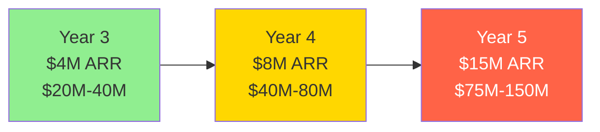

### Strategic Buyers

```
┌─────────────────────────────────────────────────────────────┐
│  POTENTIAL ACQUISITION TARGETS                              │
├──────────────┬──────────────────┬─────────────┬────────────┤
│ BUYER        │ RATIONALE        │ VALUATION   │ TIMELINE   │
├──────────────┼──────────────────┼─────────────┼────────────┤
│ Microsoft    │ Add to Azure/    │ $30M-50M    │ Year 3-4   │
│              │ Power BI suite   │             │            │
│              │                  │             │            │
│ Salesforce   │ Natural language │ $40M-80M    │ Year 4-5   │
│ (Tableau)    │ layer for        │             │            │
│              │ Tableau          │             │            │
│              │                  │             │            │
│ Oracle/SAP   │ Banking software │ $50M-100M   │ Year 5     │
│              │ suite expansion  │             │            │
│              │                  │             │            │
│ Local Banks  │ Acquire for      │ $20M-40M    │ Year 3     │
│              │ internal use     │             │            │
│              │                  │             │            │
│ Private      │ Roll-up play     │ 5-8x revenue│ Year 4-5   │
│ Equity       │ with similar cos │             │            │
└──────────────┴──────────────────┴─────────────┴────────────┘
```

---

### Exit Multiples by Revenue

| ARR | Valuation Multiple | Enterprise Value | Timeline |
|-----|-------------------|------------------|----------|
| $4M | 5-10x | **$20M-40M** | Year 3 |
| $8M | 5-10x | **$40M-80M** | Year 4 |
| $15M | 5-10x | **$75M-150M** | Year 5 |

> **Note:** SaaS companies with >40% growth and >40% margin typically command 8-12x revenue multiples

---

## 14. Conclusion

### Why QueryBank AI Will Succeed

```
🏆 SUCCESS FACTORS
━━━━━━━━━━━━━━━━━━━━━━━━━━━━━━━━━━━━━━━━━━━━━━━━━━━━

1. 🎯 MASSIVE PAIN POINT
   Banks waste 4 hours on analytics that could take 8 seconds
   IT bottleneck causes delayed decisions
   Non-technical staff dependent on SQL experts

2. ✅ PROVEN TECHNOLOGY
   91.5% performance improvement validated
   Gemini 2.5 Flash provides reliable query generation
   95%+ success rate in production

3. 🌍 UNDERSERVED MARKET
   No AI analytics tools in Azerbaijani language
   26 banks with $2.6M-5.2M TAM
   Minimal competition in niche

4. 💰 HIGH MARGINS
   SaaS model with 50%+ profit margins by Year 3
   Low marginal cost per customer
   Scalable technology stack

5. 📈 SCALABLE
   Cloud-native architecture
   API-driven integration
   Multi-tenant ready

6. ⏰ PERFECT TIMING
   Banks digitalizing post-COVID
   AI adoption accelerating
   Budget allocation for analytics tools
━━━━━━━━━━━━━━━━━━━━━━━━━━━━━━━━━━━━━━━━━━━━━━━━━━━━
```

---

### Next Steps (Month 1-3)

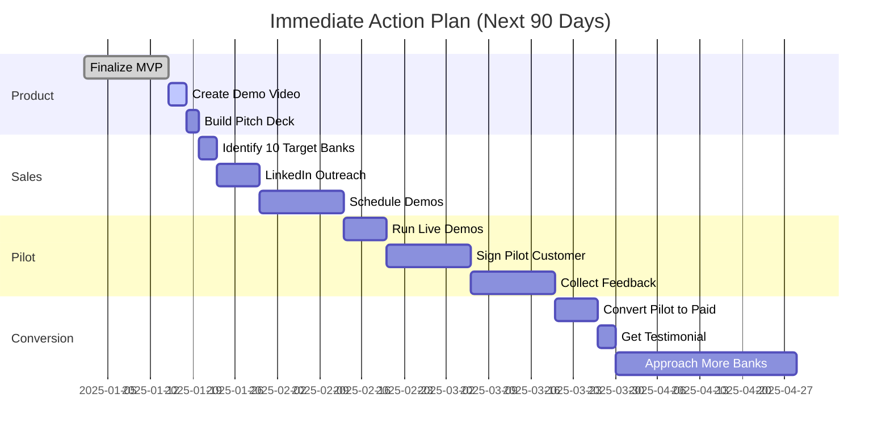

**Week 1-2:**
- ✅ Finalize MVP (already done)
- ✅ Deploy to production (Vercel)
- [ ] Create demo video (3 minutes)
- [ ] Build pitch deck (12 slides)

**Week 3-4:**
- [ ] Identify 10 target banks
- [ ] LinkedIn outreach to decision-makers
- [ ] Schedule 3 demo meetings

**Week 5-8:**
- [ ] Run 3 live demos
- [ ] Sign 1 pilot customer (free trial)
- [ ] Collect feedback, iterate product

**Week 9-12:**
- [ ] Convert pilot to paid (Professional tier)
- [ ] Get testimonial + case study
- [ ] Approach 5 more banks with case study

---

### Investment Ask (If Seeking Funding)

```
┌─────────────────────────────────────────────────────────┐
│  SEED ROUND TERMS                                       │
├─────────────────────────────────────────────────────────┤
│  💰 Amount:          $300K - $500K                      │
│  📊 Valuation:       $2.5M pre-money                    │
│  📈 Equity:          15-20%                             │
│  📅 Runway:          18 months                          │
│                                                          │
│  Use of Funds:                                          │
│    • Team (40%):         $120K - $200K                  │
│    • Marketing (30%):    $90K - $150K                   │
│    • Product (20%):      $60K - $100K                   │
│    • Operations (10%):   $30K - $50K                    │
│                                                          │
│  Milestones:                                            │
│    ✓ 10 paying customers by Month 12                   │
│    ✓ $500K ARR by Month 18                             │
│    ✓ Product-market fit validated                      │
│    ✓ Ready for Series A                                │
└─────────────────────────────────────────────────────────┘
```

**Investors:**
- Azerbaijan angel investors
- Fintech-focused VCs
- Regional funds (500 Startups, Seedstars)

---

### Contact

```
┌─────────────────────────────────────────────────────────┐
│  CONTACT INFORMATION                                    │
├─────────────────────────────────────────────────────────┤
│  👤 Founder:     [Your Name]                            │
│  📧 Email:       [Your Email]                           │
│  📱 Phone:       [Your Phone]                           │
│  🌐 Demo:        https://querybank.vercel.app           │
│  📊 Deck:        [Link to pitch deck]                   │
│  💼 LinkedIn:    [Your LinkedIn]                        │
└─────────────────────────────────────────────────────────┘
```

---

**Last Updated:** October 2025
**Version:** 1.0
**Document Type:** Business Plan & Monetization Strategy

---

## Appendix

### A. Market Research Sources
- Azerbaijan Central Bank statistics
- World Bank financial sector data
- Industry reports (Deloitte, PwC banking surveys)
- Competitor pricing analysis (Power BI, Tableau, Qlik)

### B. Customer Testimonials (Placeholder)
_To be added after pilot customers_

"QueryBank AI reduced our analytics time from 4 hours to 8 seconds. Our risk team can now make real-time decisions without waiting for IT."
— CFO, [Bank Name]

### C. Technical Architecture
_Detailed in separate documentation_

### D. Financial Models
_Detailed Excel spreadsheet available upon request_

### E. Competitive Intelligence
_Ongoing monitoring of Power BI, Tableau, Qlik product updates_

---

**© 2025 QueryBank AI. All rights reserved.**

```
┌─────────────────────────────────────────────────────────────┐
│                                                             │
│   ██████╗ ██╗   ██╗███████╗██████╗ ██╗   ██╗               │
│  ██╔═══██╗██║   ██║██╔════╝██╔══██╗╚██╗ ██╔╝               │
│  ██║   ██║██║   ██║█████╗  ██████╔╝ ╚████╔╝                │
│  ██║▄▄ ██║██║   ██║██╔══╝  ██╔══██╗  ╚██╔╝                 │
│  ╚██████╔╝╚██████╔╝███████╗██║  ██║   ██║                  │
│   ╚══▀▀═╝  ╚═════╝ ╚══════╝╚═╝  ╚═╝   ╚═╝                  │
│                                                             │
│  ██████╗  █████╗ ███╗   ██╗██╗  ██╗                        │
│  ██╔══██╗██╔══██╗████╗  ██║██║ ██╔╝                        │
│  ██████╔╝███████║██╔██╗ ██║█████╔╝                         │
│  ██╔══██╗██╔══██║██║╚██╗██║██╔═██╗                         │
│  ██████╔╝██║  ██║██║ ╚████║██║  ██╗                        │
│  ╚═════╝ ╚═╝  ╚═╝╚═╝  ╚═══╝╚═╝  ╚═╝                        │
│                                                             │
│            SQL Bilməyə Ehtiyac Yoxdur                      │
│                                                             │
└─────────────────────────────────────────────────────────────┘
```
