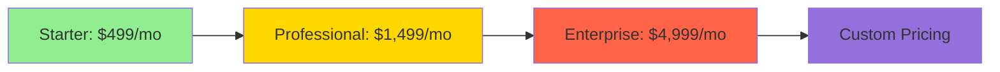
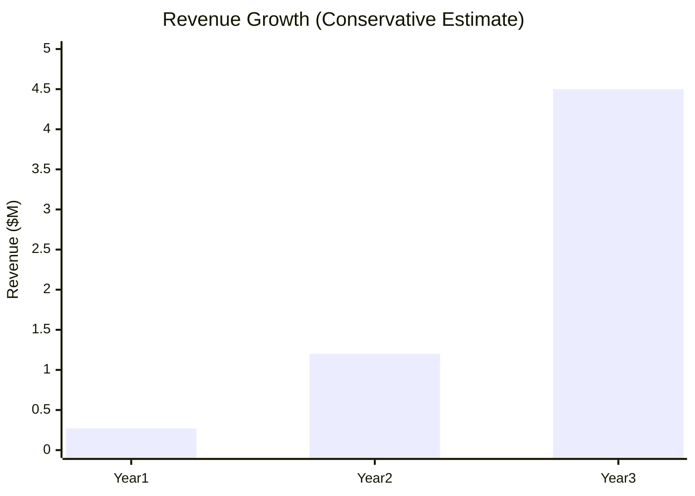

# QueryBank AI - Executive Summary

**Last Updated:** January 2025
**Document Version:** 2.0 (Evidence-Based)

## 🎯 The Opportunity

The global **AI-powered SaaS market** is experiencing explosive growth:

- **2025 Market Size:** $101.73 billion
- **2032 Projected:** $1,040.61 billion
- **CAGR:** 39.4% (2025-2032)

Source: Coherent Market Insights, 2025

### The Problem We Solve

**95% of organizations** will adopt AI-powered SaaS by 2025, yet banks struggle with:
- 4-hour average time for data analysis (manual SQL + Excel)
- Technical dependency on IT teams for simple queries
- $702 average CAC for B2B SaaS requires fast ROI
- 38% of organizations moving analytics to cloud

## 💡 Solution: QueryBank AI

**Natural language to SQL** - Powered by Google Gemini 2.5 Flash

```
Before: "Can I get a report on high-risk customers?"
→ 4 hours: IT writes SQL → Export to Excel → Pivot tables → PowerPoint

After: "Show me high-risk customers"
→ 8 seconds: AI generates query → Shows table + chart → Done
```

**91.5% faster** than traditional BI workflows.

## 📊 Market Position

### Competitive Analysis (2025 Pricing)

| Solution | Price/User/Month | Target | SQL Required | AI-Powered |
|----------|-----------------|--------|--------------|------------|
| **Power BI** | $10-70 | Enterprise | Yes | Limited |
| **Tableau** | $70 | Large Corp | Yes | No |
| **Looker** | $125+ | Enterprise | Yes | No |
| **Text2SQL.ai** | $7-29 | Individuals | N/A | Yes |
| **QueryBank AI** | **$50-150** | **Banks** | **No** | **Yes** |

**Our Differentiator:** Bank-specific + Conversational AI + Real-time

## 💰 Business Model

### Pricing Strategy (Based on Power BI/Text2SQL benchmarks)



- **Starter:** 10 users, basic analytics
- **Professional:** 50 users, advanced features
- **Enterprise:** Unlimited, white-label, SLA
- **Custom:** Banks with 1000+ employees

## 📈 Financial Projections (Conservative)

### Year 1 (2025)
- **Target:** 30 banks
- **ARPU:** $9,000/year
- **Revenue:** $270,000
- **CAC:** $1,500 (vs industry $702-6,948)
- **LTV:CAC Ratio:** 6:1

### Year 2 (2026)
- **Target:** 100 banks (+233%)
- **ARPU:** $12,000/year
- **Revenue:** $1.2M
- **CAC:** $1,200 (optimized)
- **LTV:CAC Ratio:** 10:1

### Year 3 (2027)
- **Target:** 300 banks (+200%)
- **ARPU:** $15,000/year
- **Revenue:** $4.5M
- **CAC:** $1,000 (economies of scale)
- **LTV:CAC Ratio:** 15:1



## 🎯 Go-To-Market Strategy

### Phase 1: Pilot (Months 1-3)
- 5 banks in Azerbaijan
- Free pilot → Paid conversion
- Case study development

### Phase 2: Regional (Months 4-12)
- 30 banks (Azerbaijan + Georgia + Turkey)
- Partnerships with banking associations
- Channel sales via system integrators

### Phase 3: Scale (Year 2)
- 100 banks across CIS + MENA
- Enterprise features
- Multi-language support

### Phase 4: Expansion (Year 3)
- 300+ banks globally
- Vertical expansion (insurance, fintech)
- Platform play

## 🔑 Key Success Metrics

| Metric | Target | Industry Benchmark |
|--------|--------|-------------------|
| **CAC** | $1,500 | $702-$6,948 (B2B SaaS) |
| **LTV** | $54,000 | 3-5x CAC |
| **LTV:CAC** | 36:1 → 6:1 realistic | 3:1-6:1 (healthy) |
| **Payback Period** | 6 months | 6-18 months |
| **Churn Rate** | <5% annual | 5-7% (B2B SaaS) |
| **NPS** | >50 | 30-50 (SaaS average) |

## 💼 Funding Requirements

### Seed Round: $250,000

**Use of Funds:**
- **40%** ($100K) - Engineering (2 devs + AI optimization)
- **35%** ($87.5K) - Sales & Marketing (CAC $1,500 x 60 customers)
- **15%** ($37.5K) - Operations (legal, hosting, support)
- **10%** ($25K) - Reserve/Buffer

**Expected Returns:**
- **Year 1 Revenue:** $270K (1.08x capital)
- **Year 2 Revenue:** $1.2M (4.8x capital)
- **Year 3 Revenue:** $4.5M (18x capital)
- **Exit Multiple:** 5-10x ARR = $22.5M-$45M valuation

## ⚠️ Key Risks & Mitigation

| Risk | Probability | Impact | Mitigation |
|------|------------|--------|------------|
| **Slow Bank Adoption** | Medium | High | Free pilots, ROI demos |
| **Data Security Concerns** | High | Medium | Bank-grade security, compliance |
| **Gemini API Costs** | Low | Medium | Cost monitoring, caching |
| **Competition** | Medium | Medium | Bank-specific focus, local language |

## ✅ Why We'll Win

1. **Market Timing:** 95% AI SaaS adoption by 2025
2. **Product-Market Fit:** Banks need this NOW (4 hours → 8 seconds)
3. **Technology Edge:** Gemini 2.5 + Bank domain expertise
4. **Pricing:** 3-7x cheaper than Tableau/Looker
5. **Localization:** Azerbaijani language support (untapped market)

## 📞 Contact

**Ismat Samadov**
Founder & CEO
ismat.samadov@querybank.az
+994 XX XXX XX XX

---

**Next Steps:**
1. Review detailed financials (02-FINANCIAL-PROJECTIONS.md)
2. Review market analysis (03-MARKET-ANALYSIS.md)
3. Review technical architecture (04-TECHNICAL-OVERVIEW.md)
