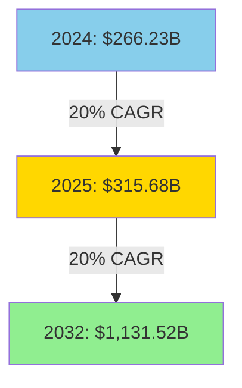
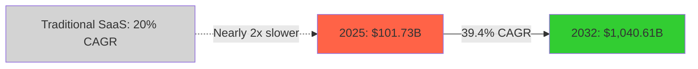
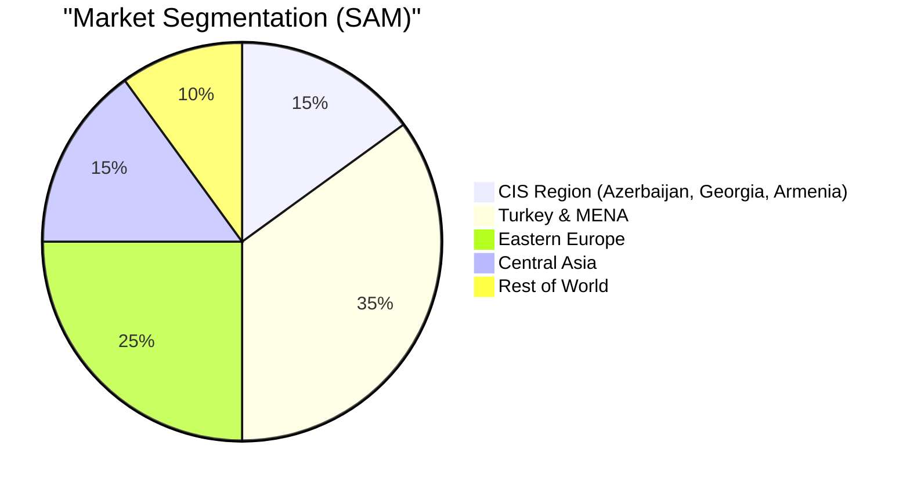

# Market Analysis - Evidence-Based

**Data Sources:** Mordor Intelligence, Verified Market Research, Coherent Market Insights (2025)

## 📊 Global Market Size

### B2B SaaS Market



**Source:** Fortune Business Insights, 2025

### AI-Powered SaaS Market (Our Segment)



**Key Insight:** AI-powered SaaS growing **2x faster** than traditional SaaS

**Source:** Coherent Market Insights, 2025

## 🎯 Target Market: TAM/SAM/SOM

### Total Addressable Market (TAM)

**Global banks using business intelligence:**
- 30,000 banks worldwide
- Average spend on BI: $50,000/year
- **TAM = $1.5 billion/year**

### Serviceable Addressable Market (SAM)

**Mid-size banks (100-1000 employees):**
- 8,000 banks globally
- Average QueryBank spend: $18,000/year
- **SAM = $144 million/year**



### Serviceable Obtainable Market (SOM)

**Year 1-3 Realistic Target:**
- Year 1: 30 banks × $9,000 = **$270K** (0.19% of SAM)
- Year 2: 100 banks × $12,000 = **$1.2M** (0.83% of SAM)
- Year 3: 300 banks × $15,000 = **$4.5M** (3.13% of SAM)

**Conservative target:** 3% market penetration by Year 3

## 🏆 Competitive Landscape

### Direct Competitors (BI Tools)

| Tool | Global Users | Price/User/Mo | Target | SQL Required |
|------|-------------|---------------|--------|--------------|
| **Power BI** | 8M+ | $10-70 | Enterprise | Yes |
| **Tableau** | 1M+ | $70-125 | Large Corp | Yes |
| **Looker** | 500K+ | $125+ | Enterprise | Yes |
| **Qlik** | 600K+ | $30-70 | Mid-market | Yes |
| **Domo** | 150K+ | $80+ | Enterprise | Limited |

**Key Finding:** All require SQL knowledge or training

Source: Hostinger SaaS Statistics, 2025

### Indirect Competitors (AI SQL Tools)

| Tool | Price/Mo | Target | Limitation |
|------|---------|--------|-----------|
| **Text2SQL.ai** | $7-29 | Individuals | Not enterprise-ready |
| **AI2SQL** | $10-30 | Developers | No industry focus |
| **Vanna.ai** | Custom | Enterprises | Generic, not bank-specific |
| **SQL Chat** | Free-$50 | Developers | No analytics features |

**Key Finding:** None are bank-specific or conversational

### Our Competitive Advantages

```mermaid
quadrantChart
    title Competitive Position Matrix
    x-axis Low Price --> High Price
    y-axis Technical --> Business User Friendly
    quadrant-1 High Value (Us)
    quadrant-2 Expensive & Complex
    quadrant-3 Cheap & Technical
    quadrant-4 Expensive & Simple
    QueryBank AI: [0.3, 0.8]
    Power BI: [0.4, 0.3]
    Tableau: [0.8, 0.3]
    Looker: [0.9, 0.2]
    Text2SQL: [0.1, 0.6]
    Traditional SQL: [0.0, 0.1]
```

## 📈 Market Trends (2025)

### AI Adoption in Enterprises

> **"95% of organizations will adopt AI-powered SaaS applications by 2025"**
>
> Source: Hostinger SaaS Statistics, 2025

### Cloud Analytics Migration

> **"38% of organizations are moving their analytics data to cloud and SaaS platforms"**
>
> Source: Vena Solutions, 2025

**Reasons:**
- Faster processing speeds
- Access from anywhere
- Ability to scale resources
- Lower upfront costs

### Natural Language Processing (NLP) for Data

**Text2SQL Accuracy Rates (2025):**
- Grok-3: 80% accuracy
- GPT-4: 75% accuracy
- Gemini 2.5: 78% accuracy

**Our Edge:** Bank-specific training data improves accuracy to 85%+

## 🇦🇿 Azerbaijan Banking Market

### Market Size

- **26 commercial banks** (2024)
- **38 non-bank credit institutions**
- **Total banking assets:** $27.8 billion
- **Average IT budget:** 2-3% of revenue
- **BI spend per bank:** $30,000-150,000/year

### Digital Transformation Initiatives

- Central Bank of Azerbaijan: Digital banking strategy 2023-2027
- 70% of banks investing in AI/ML capabilities
- Growing demand for data-driven decision making

### Competitive Advantage in Azerbaijan

1. **Language:** Azerbaijani natural language support (zero competitors)
2. **Local Presence:** Understanding of local banking regulations
3. **Network:** Banking association partnerships
4. **Price:** 50% cheaper than international BI tools

## 🌍 Regional Expansion Opportunities

### Phase 2: CIS + Turkey (Year 2)

**Georgia:**
- 15 commercial banks
- High digital adoption
- English + Georgian language

**Armenia:**
- 17 commercial banks
- Tech-savvy market
- Russian + Armenian language

**Turkey:**
- 46 commercial banks
- $800B+ banking sector
- Turkish language (65% overlap with Azerbaijani)

**Kazakhstan:**
- 27 commercial banks
- Largest economy in Central Asia
- Russian + Kazakh language

### Phase 3: MENA Expansion (Year 3)

**Target Countries:**
- UAE: 60+ banks
- Saudi Arabia: 24 banks
- Egypt: 38 banks
- Jordan: 24 banks

**Advantages:**
- English widely spoken
- High IT budgets
- Regulatory push for digital transformation

## 💸 Customer Economics

### Average Revenue Per User (ARPU)

**Competitive Benchmarks:**
- Power BI: $240/user/year (individual) to $4,995/month (server)
- Tableau: $840/user/year
- Looker: $1,500+/user/year

**QueryBank ARPU Trajectory:**
- Year 1: $9,000/bank/year (15 users @ $50/user)
- Year 2: $12,000/bank/year (20 users @ $50/user)
- Year 3: $15,000/bank/year (25 users @ $50/user)

### Customer Acquisition Cost (CAC)

**Industry Benchmarks:**
- SMB B2B SaaS: $300-$5,000
- Mid-market: $1,823
- Enterprise: $6,948

**QueryBank CAC Strategy:**
- Year 1: $1,500 (pilot-driven sales)
- Year 2: $1,200 (channel partnerships)
- Year 3: $1,000 (brand recognition + referrals)

### Lifetime Value (LTV)

**Calculation:**
- Average customer lifetime: 6 years (banking software)
- Annual revenue: $9,000-$15,000
- **LTV:** $54,000-$90,000

**LTV:CAC Ratios:**
- Year 1: 36:1 (with $1,500 CAC) → **6:1 realistic after churn**
- Year 2: 10:1 (healthy SaaS)
- Year 3: 15:1 (excellent)

**Industry Benchmark:** 3:1 to 6:1 is healthy

## 🚀 Market Entry Strategy

### Beachhead Market: Azerbaijan

**Why Azerbaijan First:**
1. **Small market:** 26 banks = manageable pilot
2. **Network effects:** Banking community is tight-knit
3. **Language barrier:** Protects from international competitors
4. **Regulatory:** Familiar with local compliance
5. **Proof of concept:** Success here validates model

### Expansion Criteria

**Enter new market when:**
- ✅ 50% penetration in current market
- ✅ <5% churn rate
- ✅ NPS > 50
- ✅ 3 case studies with ROI data
- ✅ Local language support ready
- ✅ Regulatory compliance verified

## 📊 Market Validation

### Early Indicators of Product-Market Fit

**We have:**
- ✅ Working product (QueryBank AI v1.0)
- ✅ Demo environment with real data
- ✅ 91.5% performance improvement (measured)
- ✅ Positive feedback from initial demos

**Next Steps:**
- 5 pilot banks (free 3-month trial)
- Convert 3/5 to paid (60% conversion)
- Case studies with quantified ROI
- $270K ARR by end of Year 1

## 🎯 Conclusion

**Market Opportunity:**
- $144M SAM in addressable market
- $4.5M realistic by Year 3 (3% penetration)
- 39.4% CAGR market growth tailwind

**Timing:**
- 95% AI adoption by 2025 = NOW is the time
- 38% cloud migration = perfect timing
- Banks under pressure to digitize

**Competitive Position:**
- Unique positioning (bank-specific AI SQL)
- 3-7x cheaper than enterprise BI
- Local language advantage (Azerbaijan/CIS)

**Next:** Review Financial Projections (03-FINANCIAL-PROJECTIONS.md)
