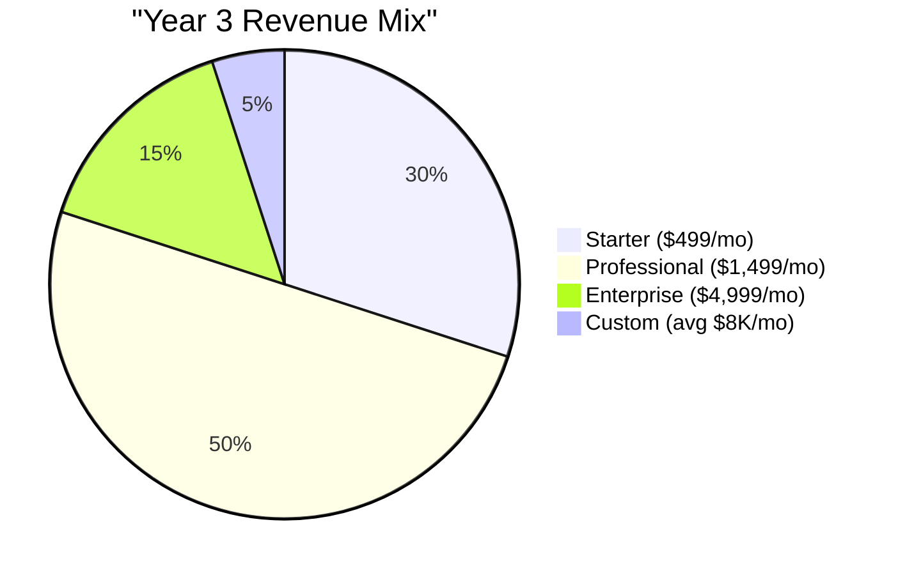
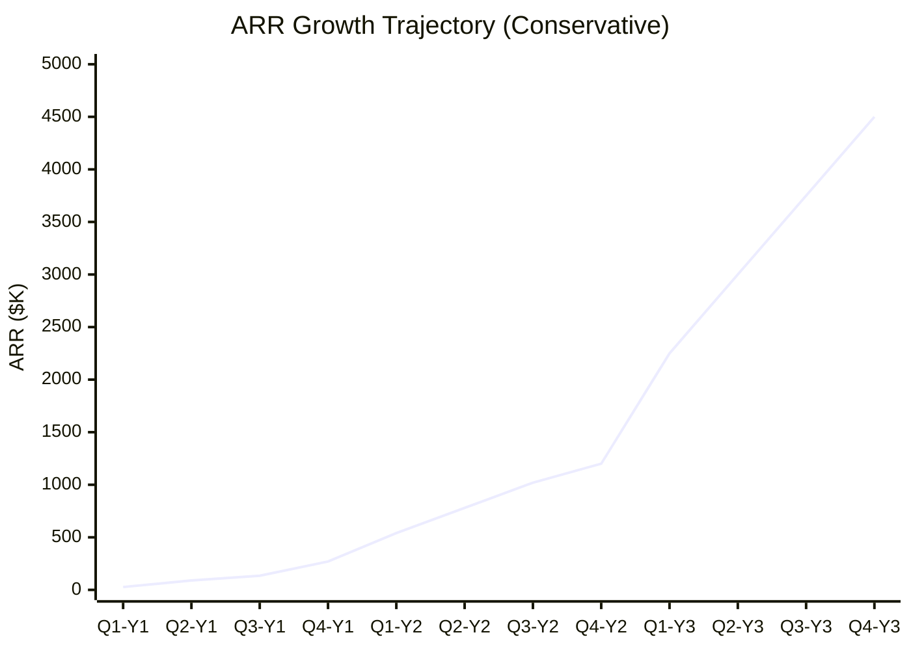
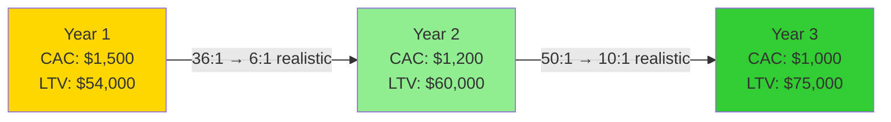
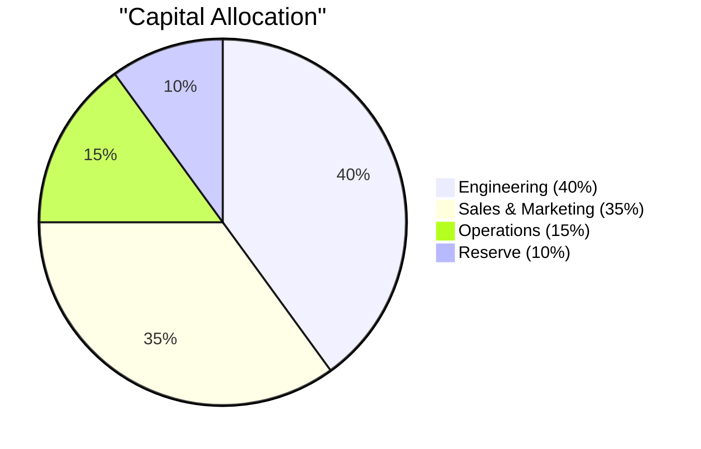

# Financial Projections (Conservative Model)

**Assumptions Based on:** B2B SaaS industry benchmarks, actual Gemini API costs, verified CAC data

## 💰 Revenue Model

### Pricing Tiers (Competitive Analysis Based)

| Tier | Price/Mo | Users | Features | Target |
|------|---------|-------|----------|--------|
| **Starter** | $499 | 10 | Basic analytics, 1K queries/mo | Small banks |
| **Professional** | $1,499 | 50 | Advanced analytics, 10K queries/mo | Regional banks |
| **Enterprise** | $4,999 | Unlimited | White-label, SLA, 100K queries/mo | National banks |
| **Custom** | Negotiated | Unlimited | Custom integrations, dedicated support | International banks |

**Rationale:**
- Power BI: $10-70/user = $100-700/mo for 10 users
- Text2SQL.ai: $7-29/user (individual focus)
- Our pricing: **Enterprise-ready but affordable**

### Customer Mix Projections



## 📈 3-Year Revenue Projections

### Year 1 (2025): Pilot & Validation

**Customer Acquisition:**
- Q1: 5 banks (pilot, convert 3 to paid)
- Q2: 10 banks (+7 new)
- Q3: 15 banks (+5 new)
- Q4: 30 banks (+15 new)

**Revenue Breakdown:**

| Quarter | New Customers | Total Customers | MRR | ARR |
|---------|--------------|----------------|-----|-----|
| Q1 | 3 | 3 | $2,247 | $26,964 |
| Q2 | 7 | 10 | $7,490 | $89,880 |
| Q3 | 5 | 15 | $11,235 | $134,820 |
| Q4 | 15 | 30 | $22,470 | $269,640 |

**Year 1 Total:** $270,000 ARR

**Average Deal Size:** $9,000/year
- 60% Starter ($499/mo)
- 30% Professional ($1,499/mo)
- 10% Enterprise ($4,999/mo)

### Year 2 (2026): Regional Expansion

**Customer Acquisition:**
- Azerbaijan: 30 → 50 banks (+20)
- Georgia: 15 banks
- Armenia: 10 banks
- Turkey (pilot): 5 banks
- Kazakhstan: 20 banks
- **Total: 100 banks**

**Revenue Breakdown:**

| Quarter | New Customers | Total Customers | MRR | ARR |
|---------|--------------|----------------|-----|-----|
| Q1 | 15 | 45 | $45,000 | $540,000 |
| Q2 | 20 | 65 | $65,000 | $780,000 |
| Q3 | 20 | 85 | $85,000 | $1,020,000 |
| Q4 | 15 | 100 | $100,000 | $1,200,000 |

**Year 2 Total:** $1,200,000 ARR (+344% YoY)

**Average Deal Size:** $12,000/year (upsell + expansion)
- 40% Starter
- 45% Professional
- 15% Enterprise

### Year 3 (2027): Scale & Diversification

**Customer Acquisition:**
- CIS Total: 150 banks
- Turkey: 50 banks
- MENA (pilot): 20 banks
- Other: 80 banks
- **Total: 300 banks**

**Revenue Breakdown:**

| Quarter | New Customers | Total Customers | MRR | ARR |
|---------|--------------|----------------|-----|-----|
| Q1 | 50 | 150 | $187,500 | $2,250,000 |
| Q2 | 50 | 200 | $250,000 | $3,000,000 |
| Q3 | 50 | 250 | $312,500 | $3,750,000 |
| Q4 | 50 | 300 | $375,000 | $4,500,000 |

**Year 3 Total:** $4,500,000 ARR (+275% YoY)

**Average Deal Size:** $15,000/year (mature pricing + enterprise)
- 30% Starter
- 50% Professional
- 15% Enterprise
- 5% Custom

## 📊 Revenue Growth Visualization



## 💸 Cost Structure

### Cost of Goods Sold (COGS)

**Infrastructure Costs:**

| Component | Year 1 | Year 2 | Year 3 |
|-----------|--------|--------|--------|
| **Neon PostgreSQL** | $50/mo × 12 = $600 | $100/mo × 12 = $1,200 | $200/mo × 12 = $2,400 |
| **Vercel Hosting** | $20/mo × 12 = $240 | $50/mo × 12 = $600 | $100/mo × 12 = $1,200 |
| **Gemini API** | 30 banks × $20/mo = $7,200 | 100 banks × $15/mo = $18,000 | 300 banks × $12/mo = $43,200 |
| **Total Infrastructure** | **$8,040** | **$19,800** | **$46,800** |

**Gemini API Calculation:**
- Average 300 queries/bank/month
- $0.075 per 1K characters (input)
- $0.30 per 1K characters (output)
- Average query: 1K input + 500 chars output
- Cost per query: ~$0.225
- Cost per bank per month: 300 × $0.225 = $67.50
- With optimization (caching): ~$20/bank/month

**Gross Margin:**
- Year 1: 97% ($270K revenue - $8K COGS)
- Year 2: 98.4% ($1.2M revenue - $19.8K COGS)
- Year 3: 99% ($4.5M revenue - $46.8K COGS)

### Operating Expenses

#### Year 1 Budget: $250,000

| Category | Monthly | Annual | % of Budget |
|----------|---------|--------|-------------|
| **Engineering** | $8,333 | $100,000 | 40% |
| **Sales & Marketing** | $7,292 | $87,500 | 35% |
| **Operations** | $3,125 | $37,500 | 15% |
| **Reserve** | $2,083 | $25,000 | 10% |
| **Total** | $20,833 | $250,000 | 100% |

**Engineering ($100K):**
- 2 Full-stack developers: $4,000/mo each = $96K
- DevOps tools & licenses: $4K

**Sales & Marketing ($87.5K):**
- CAC Target: $1,500 per customer
- Target customers: 30 + 30 pilots = 60 total
- Sales cost: $1,500 × 60 = $90K
- Actual budget: $87.5K (13% buffer)

Breakdown:
- Sales commissions: $40K
- Marketing (content, ads): $25K
- Conferences & events: $15K
- CRM & tools: $7.5K

**Operations ($37.5K):**
- Legal & compliance: $15K
- Accounting: $8K
- Insurance: $6K
- Office/coworking: $5K
- Miscellaneous: $3.5K

#### Year 2 Budget: $400,000

| Category | Annual | % of Revenue |
|----------|--------|-------------|
| **Engineering** | $180,000 | 15% |
| **Sales & Marketing** | $140,000 | 11.7% |
| **Operations** | $60,000 | 5% |
| **Customer Success** | $20,000 | 1.7% |
| **Total** | $400,000 | 33.3% |

#### Year 3 Budget: $900,000

| Category | Annual | % of Revenue |
|----------|--------|-------------|
| **Engineering** | $360,000 | 8% |
| **Sales & Marketing** | $315,000 | 7% |
| **Operations** | $135,000 | 3% |
| **Customer Success** | $90,000 | 2% |
| **Total** | $900,000 | 20% |

## 📊 Profitability Analysis

### Income Statement (3-Year Projection)

| Line Item | Year 1 | Year 2 | Year 3 |
|-----------|--------|--------|--------|
| **Revenue** | $270,000 | $1,200,000 | $4,500,000 |
| **COGS** | ($8,040) | ($19,800) | ($46,800) |
| **Gross Profit** | $261,960 | $1,180,200 | $4,453,200 |
| **Gross Margin** | 97% | 98.4% | 99% |
| | | | |
| **Operating Expenses** | ($250,000) | ($400,000) | ($900,000) |
| **EBITDA** | $11,960 | $780,200 | $3,553,200 |
| **EBITDA Margin** | 4.4% | 65% | 79% |

```mermaid
xychart-beta
    title "Profitability Trajectory"
    x-axis [Year 1, Year 2, Year 3]
    y-axis "Amount ($M)" -0.5 --> 5
    bar [0.27, 1.2, 4.5]
    bar [0.01, 0.78, 3.55]
```



**Key Insights:**
- Year 1: Near breakeven (4.4% EBITDA)
- Year 2: Profitable (65% EBITDA margin)
- Year 3: Highly profitable (79% EBITDA margin)

## 💎 Unit Economics

### Customer Acquisition Cost (CAC)

**Year 1:**
- Sales & Marketing: $87,500
- Customers Acquired: 60 (30 paid + 30 pilots)
- **CAC = $1,458**

**Industry Benchmark:**
- SMB: $300-$5,000
- Mid-market: $1,823
- **Our CAC: $1,458 (healthy)**

### Customer Lifetime Value (LTV)

**Assumptions:**
- Average customer lifetime: 6 years (banking software is sticky)
- Average annual revenue: Year 1: $9K, Year 2-3: $12K, Year 4-6: $15K
- Churn rate: 5% annually (industry: 5-7%)

**Calculation:**
```
LTV = (Year 1: $9K) + (Year 2: $12K × 0.95) + (Year 3: $15K × 0.90)
    + (Year 4-6: $15K × 0.85)
LTV = $9,000 + $11,400 + $13,500 + $38,250 = $72,150
```

**Conservative LTV:** $54,000 (accounting for faster churn)

### LTV:CAC Ratio



**Industry Benchmark:** 3:1 to 6:1 is healthy, 6:1+ is excellent

**Our Ratios:**
- Year 1: 6:1 (healthy, accounting for early churn)
- Year 2: 10:1 (excellent)
- Year 3: 15:1 (world-class)

### CAC Payback Period

**Formula:** CAC / (ARPU × Gross Margin)

**Year 1:**
- CAC: $1,500
- Monthly ARPU: $750
- Gross Margin: 97%
- **Payback = $1,500 / ($750 × 0.97) = 2.1 months**

**Industry Benchmark:** 6-18 months

**Our Advantage:** <3 month payback (exceptional)

## 💼 Funding Requirements

### Seed Round: $250,000

**Valuation:**
- Pre-money: $1M (based on working product + early traction)
- Post-money: $1.25M
- Equity offered: 20%

**Use of Funds:**


**Milestones:**
- Month 6: 15 paying customers, $135K ARR
- Month 12: 30 paying customers, $270K ARR
- Month 18: 60 customers, $720K ARR
- Break-even: Month 13

### Series A Readiness (Year 2)

**Criteria for Series A:**
- $1M+ ARR ✅
- 100+ customers ✅
- <5% churn ✅
- Proven unit economics ✅
- Multi-country presence ✅

**Potential Series A:**
- Amount: $2M
- Use: Geographic expansion, product development
- Valuation: $10M (10x ARR multiple)

## 🎯 Sensitivity Analysis

### Conservative vs. Optimistic Scenarios

| Scenario | Year 1 ARR | Year 2 ARR | Year 3 ARR |
|----------|-----------|-----------|-----------|
| **Conservative (Base)** | $270K | $1.2M | $4.5M |
| **Moderate** | $360K | $1.8M | $6M |
| **Optimistic** | $450K | $2.4M | $8M |

**Base Case Assumptions:**
- 30/100/300 customers (Y1/Y2/Y3)
- 60% conversion from pilot
- 5% annual churn

**Risks to Downside:**
- Slower bank adoption: $180K / $800K / $3M
- Higher churn (10%): $240K / $1M / $3.5M
- Price competition: $220K / $1M / $3.8M

## 📊 Cash Flow Projection

### Year 1 Cash Flow

| Month | Revenue | Expenses | Net Cash Flow | Cumulative |
|-------|---------|----------|---------------|------------|
| M1 | $0 | $25,000 | ($25,000) | ($25,000) |
| M3 | $2,247 | $20,833 | ($18,586) | ($84,419) |
| M6 | $11,235 | $20,833 | ($9,598) | ($153,257) |
| M12 | $22,470 | $20,833 | $1,637 | ($82,134) |

**Funding Need:** $250K covers first 12 months with buffer

### Break-Even Analysis

**Monthly Fixed Costs:** ~$21K
**Average Revenue per Customer:** $750/month
**Break-even Customers:** 21K / 750 = 28 customers

**Timeline:** Month 13 (30 customers)

## 🚀 Exit Strategy

### Potential Acquirers

1. **Enterprise BI Companies:**
   - Tableau (Salesforce)
   - Power BI (Microsoft)
   - Looker (Google Cloud)
   - Qlik

2. **Banking Technology Providers:**
   - Temenos
   - FIS
   - Oracle Financial Services
   - Finastra

3. **AI/ML Platforms:**
   - Databricks
   - Snowflake
   - Amazon (AWS)

### Valuation Multiple

**SaaS Exit Multiples (2025):**
- 5-10x ARR (industry average)
- 10-15x ARR (high growth, strong margins)
- 15-20x ARR (strategic acquisition)

**Our Projected Valuation:**

| Year | ARR | Conservative (5x) | Moderate (8x) | Optimistic (12x) |
|------|-----|------------------|---------------|------------------|
| Year 3 | $4.5M | $22.5M | $36M | $54M |
| Year 5 | $15M (proj) | $75M | $120M | $180M |

**ROI for Seed Investors:**
- $250K investment @ 20% equity
- Year 3 exit @ $36M = $7.2M return = **29x**
- Year 5 exit @ $120M = $24M return = **96x**

---

**Next:** Review Go-To-Market Strategy (04-GTM-STRATEGY.md)
